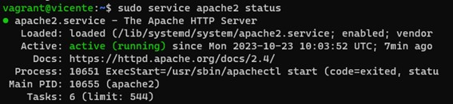
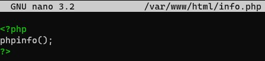
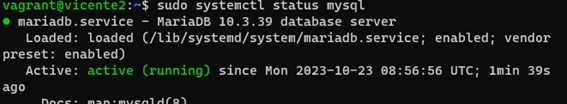
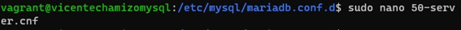
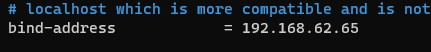
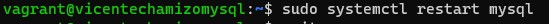
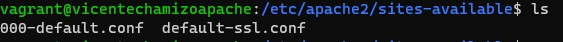
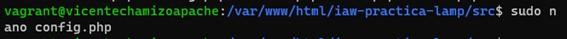
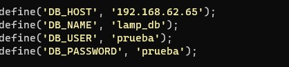
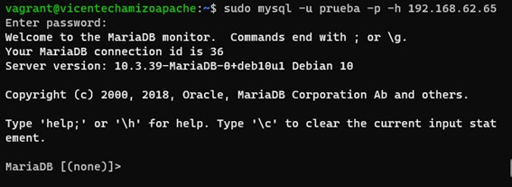

# LampDosNiveles
#### Para crear una pila LAMP en dos niveles comezaremos creando unos ficheros de aprovisionamiento
#### esta primera imagen es el fichero de apache2

#### esta segunda pertenece a php

#### y por ultimo tenemos la de mysql. 

#### Estos ficheros deben tener la extension ` .sh ` y la opcion ` -y ` es para aceptar la descarga cuando nos salga la opcion ` yes/no `
#### Ahora editaremos el fichero vagrantfile para crear las maquinas con su aprovisionamiento, su direccion ip para tenerlas en la misma red, un puerto para su acceso y una direccion ip publica en el caso de la maquina de apache

#### estas dos capturas sigentes son el comando para realizar el aprovisionamientos de las maquinas 

#### con el comando ` sudo service apache2 status ` comprovaremos si el servicio apache esta activo

#### para comprovar si php funciona editaremos el fichero **info.php** en el directorio  **/var/www/html**

#### una vez editado provaremos si esta activo poniendo en internet la direccion ip junto con el puerto y el nombre del fichero debiendo mostrar una pagina predeterminada

#### para comprobar si mysql esta funcionando debemos ir a la maquina de mysql y ejecutar la orden ` sudo systemctl status mysql ` 

## Ahora pasaremos a configurar la base de datos
#### Lo primero es bajar el repositorio con en comando ` git clone ` como podemos ver en la imagen

#### a continuacion para poder tener acceso desde la otra maquina editaremos el **fichero 50-server.conf** que se encuentra en **/etc/mysql/mariadb.conf.d** para ponerle una ip que este en la misma red.

#### Una vez editado accederemos a la base de datos con el usuario root y crearemos otro usuario
#### para acceder como root usaremos el comando ` sudo mysql -u root -p `
#### y usaremos el comando create user para crear el usuario nuevo

#### Ahora le daremos todos los permisos de la base de datos que queramos a dicho usuario con el comando ` grant all privileges `

#### Para cargar la base de datos que se a bajado anterior mente accedederemos a dicho directorio y entraremos a la carpeta db y ejecutaremos el comando ` sudo mysql u root -p < database.sql `

#### Para ver si se a bajado la base de datos accederemos a mysql y con la orden ` show databases; ` podemos comprobar que esta ahi

#### ahora reiniciaremos mysql y ya estaria todo echo.

## Configuracion de apache2
#### Para empezar accederemos al directorio **/var/www/html** y bajaremos el repositorio anterior 

#### en el directorio sites-available editaremos el fichero **000-default.conf** y editaremos la linea documentroot con la direccion del repositorio bajado antes en el cual se encuentra **src** 

#### para despues acceder a la base de datos atraves de internet iremos al directorio src y editaremos **config.php** con los siguentes datos

#### La direccion ip del servidor mysql
#### El nombre de la base de datos a la que tiene permisos 
#### El nombre del usuario con los permisos
#### Y su contraseña

#### Ahora reiniciamos el servidor apache para que se realizen los cambios ejecutados anteriormente.

## Comprovacion
#### Para comprobar si esta esta funcionando correctamente podemos probar a a acceder desde la maquina apache a la base de datos con el usuario creado

#### una vez accedidos a esta podemos añadir campos y estos podran verse accediendo desde internet

#### o en el caso contrario podemos añadir desde internet campos y se podran visualizar en la base de datos.

